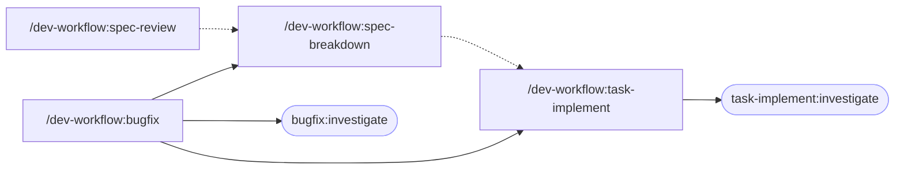

# claude-plugins

A marketplace of Claude Code plugins for software development workflows.

## Philosophy

Most AI-assisted development tools are designed around what AI *can* do. This plugin is designed around what AI *gets wrong*.

Common failure modes in AI-assisted development — silent gap resolution, state loss across sessions, scope creep during investigation, and unverifiable decision trails — are not edge cases. They are structural. This plugin treats them as first-class design constraints.

The result is a human-AI collaboration model rather than full automation. Checkpoints surface ambiguities before they compound. Approval gates keep humans in the loop at consequential decisions. Required gaps block progress until resolved. The goal is completion rate, not automation rate.

The plugin ships as a domain-agnostic core. Domain-specific behavior — iOS, Android, or otherwise — is layered in via separate skills and project-local `CLAUDE.md`, keeping the core stable across contexts.

## Install

Add this marketplace to Claude Code:

```shell
/plugin marketplace add plusnine/claude-plugins
```

Then install the plugin:

```shell
/plugin install dev-workflow@plusnine-claude-plugins
```

## Plugins

### dev-workflow

A set of skills for structured spec-driven development.

| Skill | Description |
|-------|-------------|
| `/dev-workflow:spec-review` | Review specifications for completeness before implementation |
| `/dev-workflow:spec-breakdown` | Decompose spec-review artifacts into coarse tasks |
| `/dev-workflow:task-implement` | Investigate codebase, resolve spec gaps, implement a single task, and create a draft PR |
| `/dev-workflow:bugfix` | Investigate a bug from a BTS/ITS ticket, resolve spec conflicts, and orchestrate the full fix flow |

#### Workflow

```
# Feature development
spec-review → spec-breakdown → task-implement

# Bug fix
bugfix → (spec-breakdown → task-implement)
```

**Feature development:**
1. `/dev-workflow:spec-review {source}` — Review the spec and surface gaps
2. `/dev-workflow:spec-breakdown {id}` — Decompose into coarse tasks
3. `/dev-workflow:task-implement {id} {nn}` — Implement a task and create a draft PR

**Bug fix:**
1. `/dev-workflow:bugfix {source}` — Investigate root cause, resolve conflicts, and run the full fix flow automatically

## Components

| Command | Invokes | Reads | Writes |
|---|---|---|---|
| `/dev-workflow:spec-review {source}` | — | `{source}` (URL or file path) | `claude-output/{id}/spec-review/{source.md, review.md}` |
| `/dev-workflow:spec-breakdown {id}` | — | `spec-review/source.md` or `bugfix/investigation-report.md` (FINAL) | `claude-output/{id}/spec-breakdown/{plan.md, tasks/*.md}` |
| `/dev-workflow:task-implement {id} {nn}` | `task-implement:investigate` agent | `spec-breakdown/tasks/{nn}-*.md`, `spec-review/source.md` or `bugfix/investigation-report.md` | `claude-output/{id}/task-implement/{nn}-{plan,progress,spec-gaps,done,skipped}.md` + branch/commit/draft PR |
| `/dev-workflow:bugfix {source}` | `bugfix:investigate` agent, `/dev-workflow:spec-breakdown`, `/dev-workflow:task-implement` | ticket URL | `claude-output/{id}/bugfix/{meta,investigation-report,spec-conflicts,done}.md` |



Legend: solid arrow = programmatic invocation; dashed arrow = typical user sequence.

Agents (`task-implement:investigate`, `bugfix:investigate`) are read-only: they use Glob/Grep/Read tools only and cannot modify files.

## Behavior

### Resumability

Each command is resumable. On re-run with the same `{id}`, resume position is derived from the files present in `claude-output/{id}/`. See the Checkpoint section in each command file for exact resume rules.

### CLAUDE.md Integration

The plugin reads from and proposes additions to the project root `CLAUDE.md` in two ways:

**Investigation Entry Points** — When `task-implement` or `bugfix` investigates an area not listed in `Investigation Entry Points`, it proposes new entries. Additions are written only after user approval — never silently.

**Domain Profile (optional)** — For teams that want deterministic investigation behavior, the project root `CLAUDE.md` may define a `Domain Profile` section. When present, agents follow its `Unknown Area Protocol` during investigation of unknown areas. When absent, agents fall back to general codebase conventions (build/config marker detection + conventional entry files), and propose identified entry points to the user for approval.

Format for `Domain Profile`:

````markdown
## Domain Profile

### Unknown Area Protocol

1. Read {build-structure file patterns} to identify the affected module
2. Within the identified module, read {entry file patterns in priority order}

### Conventions

- File extensions: {extensions}
- Architecture entry points: {component patterns}
````

### Language

File output is always written in English. User-facing messages (previews, prompts, diffs) follow the `language` setting in `~/.claude/settings.json`, falling back to English if unset.

### Boundaries

What this plugin does not do:

- Auto-merge PRs — all PRs are created as Draft
- Proceed past unresolved 🔴 Required spec gaps or spec conflicts
- Decide scope (task splits, file edits, branch creation, commits) without user approval
- Modify the project root `CLAUDE.md` without user approval

## Output

Skills write their output to `claude-output/{id}/` in **your project directory** (not in this plugin).

```
claude-output/{id}/
├── spec-review/
│   ├── source.md          # cached spec content
│   └── review.md          # review result
├── spec-breakdown/
│   ├── plan.md            # coarse task list
│   └── tasks/
│       ├── 01-*.md        # task prompt files
│       └── 02-*.md
├── task-implement/
│   ├── {nn}-plan.md
│   ├── {nn}-progress.md
│   ├── {nn}-spec-gaps.md
│   └── {nn}-done.md       # or {nn}-skipped.md
└── bugfix/
    ├── meta.md
    ├── investigation-report.md
    ├── spec-conflicts.md
    └── done.md
```

It is recommended to add `claude-output/` to your project's `.gitignore`:

```gitignore
claude-output/
```

## Requirements

- Claude Code (latest version)
